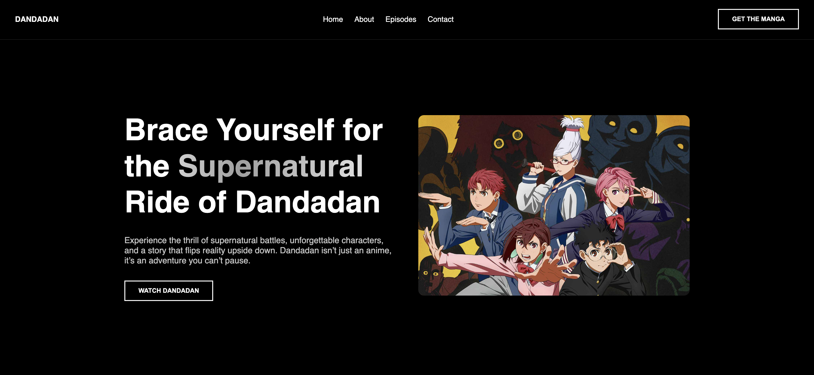

# Dandadan WebPage Notes

This project is a static landing page inspired by the manga **DANDADAN**.  
The goal was to practice **clean layout, modular CSS architecture and scalable front-end structure** while building a visually appealing anime-style site.

This site prioritizes:
- Clear visual hierarchy
- Reusable UI patterns
- Maintainable CSS organization
- Professional project structure

# Goals
- Build a full landing page from scratch
- Improve layout, typography and spacing fundamentals
- Learn how to structure CSS for scalability
- Treat the project like a real deliverable

# Tech Stack
- HTML5 (semantic sections)
- CSS3 (modular architecture)

# Hero Section
The hero section introduces the site with a prominent banner featuring key visuals from Dandadan.

Highlights:
* Bold hero banner with main title
* Clear navigation
* Immediate visual context for the manga

# Character Section
The Characters section showcases the main cast of Dandadan.

Focuses on:
* Readable, structured character cards
* Visual hierarchy with names and descriptions
* Modular styling for reusability

# Episode Section
The Episodes section presents individual episodes in a clean, grid-style layout.

Emphasizes:
* Easily scannable episode cards
* Hover effects for interactive feedback
* Consistent typography and spacing

# Manga Section
The Manga section highlights story arcs and important plot points.

Includes:
* Arc cards with images and subtitles
* Clear separation of story sections
* Easy navigation through multiple arcs

